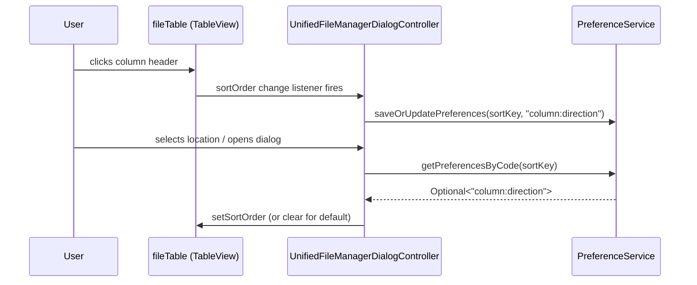

# Design Document: File Manager Recent Ordering

## Overview

Persist the user's last-used sort column and direction per location in the File Manager dialog. The sort preference is saved on column-click and restored on location load, using the same `PreferenceService` already used for last-path persistence.

The change is small: ~30 lines in `UnifiedFileManagerDialogController`. No new classes, services, or dependencies.

## Architecture

No new layers. The controller already owns the table setup and already calls `PreferenceService` for last-path. We add a parallel save/restore for sort ordering using the same pattern.

## Components and Interfaces

### Modified: `UnifiedFileManagerDialogController`

New private methods:

| Method | Purpose |
|--------|---------|
| `sortKey()` | Returns the preference key for sort ordering, e.g. `file_manager_sort_local` or `file_manager_sort_{serverName}`. Mirrors `lastPathKey()`. |
| `saveSortOrdering()` | Reads current `fileTable.getSortOrder()`, encodes as `"columnId:ASC"` or `"columnId:DESC"`, and persists via `PreferenceService`. |
| `restoreSortOrdering()` | Reads preference, decodes, finds the matching column in `fileTable.getColumns()`, and applies it to `fileTable.getSortOrder()`. Falls back to clearing sort order (triggering default comparator) on any failure. |

New listener (added in `setupFileTable()`):
- `fileTable.getSortOrder().addListener((ListChangeListener)` → calls `saveSortOrdering()` on any change.

Modified call site:
- `loadFiles()` → replace `fileTable.getSortOrder().clear()` with `restoreSortOrdering()`.

### Encoding Format

Sort ordering is stored as a single string: `columnFxId:ASCENDING` or `columnFxId:DESCENDING`.

- `columnFxId` matches the `fx:id` of the `TableColumn` (e.g. `nameColumn`, `modifiedColumn`).
- Direction uses `TableColumn.SortType.name()` — either `ASCENDING` or `DESCENDING`.
- Delimiter: `:` (colon). Column IDs in this codebase are simple camelCase identifiers with no colons.

Example values: `nameColumn:ASCENDING`, `modifiedColumn:DESCENDING`, `sizeColumn:ASCENDING`.

### No Changes To

- `PreferenceService` interface (already has `saveOrUpdatePreferences` and `getPreferencesByCode`)
- `Preference` model
- FXML layout
- Any other controller or service

## Data Models

No new models. The preference is stored as a plain `String` value in the existing `Preference` entity, keyed by a code string.

### Preference Keys

| Location | Key |
|----------|-----|
| Local drive | `file_manager_sort_local` |
| Remote server "prod-web" | `file_manager_sort_prod-web` |

This follows the existing pattern: `file_manager_last_path_local` / `file_manager_last_path_{serverName}`.

## Correctness Properties

*A property is a characteristic or behavior that should hold true across all valid executions of a system — essentially, a formal statement about what the system should do. Properties serve as the bridge between human-readable specifications and machine-verifiable correctness guarantees.*

### Property 1: Sort ordering round-trip

*For any* valid sortable column identifier and any sort direction (ASCENDING or DESCENDING), encoding the pair as a preference string and then decoding it back SHALL produce the original column identifier and direction.

**Validates: Requirements 1.2, 2.2**

### Property 2: Location key uniqueness

*For any* two distinct location identifiers (local vs. any server name, or two different server names), the computed sort preference keys SHALL be different strings.

**Validates: Requirements 3.1**

### Property 3: Malformed preference fallback

*For any* string that is blank, lacks the `:` delimiter, or whose column portion does not match any sortable column fx:id, the restore logic SHALL fall back to the default sort (empty sort order on the table) without throwing an exception.

**Validates: Requirements 4.1, 4.2**

## Error Handling

| Scenario | Behavior |
|----------|----------|
| `PreferenceService.saveOrUpdatePreferences` throws | Log warning, do not interrupt user. Sort still applies to the table (just not persisted). |
| `PreferenceService.getPreferencesByCode` throws | Log warning, fall back to default sort. |
| Saved column ID not found in table | Fall back to default sort (clear sort order). |
| Saved value blank or malformed | Fall back to default sort. |
| `currentLocation` is null when `sortKey()` called | Return a safe fallback key (`file_manager_sort_local`). Same as `lastPathKey()` behavior. |

All error paths use `logger.warn(...)` and continue normally. No user-facing error dialogs for sort persistence failures.

## Testing Strategy

### Property-Based Tests

Use **jqwik** (already available on the JVM, zero extra dependencies needed for property testing of pure logic).

Each property test runs a minimum of 100 iterations.

| Property | What it generates | What it checks |
|----------|-------------------|----------------|
| Sort ordering round-trip | Random column IDs from the known set × {ASCENDING, DESCENDING} | `decode(encode(col, dir)) == (col, dir)` |
| Location key uniqueness | Random pairs of distinct non-blank strings | `sortKey(a) != sortKey(b)` |
| Malformed preference fallback | Random strings (blank, no colon, unknown column, unicode garbage) | Decode returns empty/fallback, no exception |

Tag format: `@Label("Feature: file-manager-recent-ordering, Property N: ...")` on each `@Property` method.

### Unit Tests (Example-Based)

- Save on column click: mock `PreferenceService`, click a column, verify `saveOrUpdatePreferences` called with expected key and encoded value.
- Restore on load: set a preference, trigger `loadFiles`, verify `fileTable.getSortOrder()` contains the correct column and direction.
- Fallback when no preference: ensure empty preference results in default sort (empty sort order).
- Location isolation: save sort for local, switch to remote with different saved sort, verify each restores independently.
- Error resilience: mock service to throw on save, verify no exception propagates.

### What We Don't Test

- JavaFX TableView internal sort mechanics (platform responsibility).
- PreferenceService persistence to database (integration test territory, already covered elsewhere).
